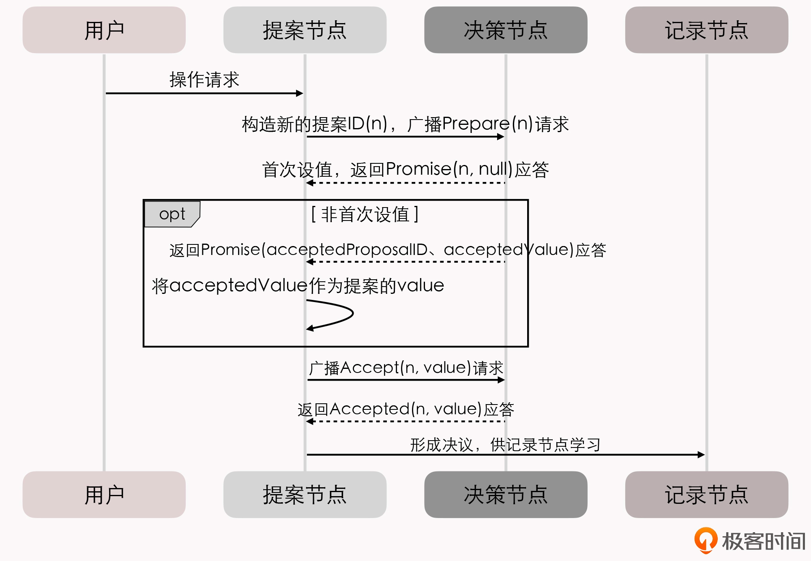
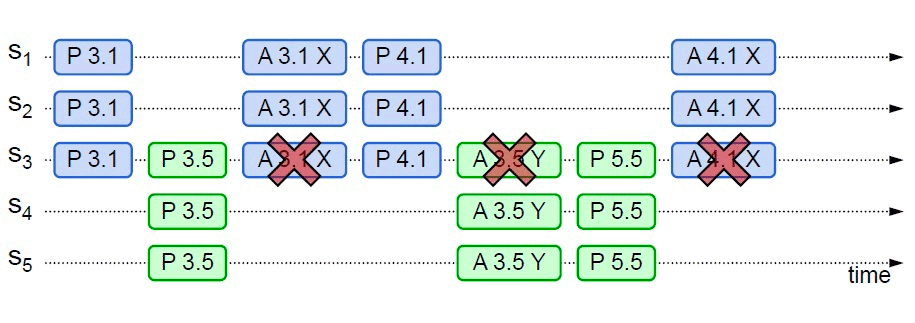
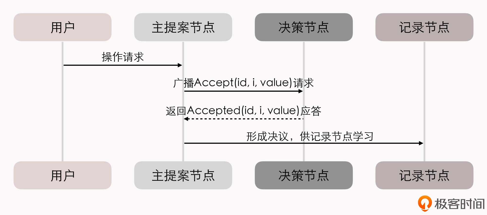

# 共识算法学习总结
## 1. 什么是共识算法
《三体》中面壁者雷迪亚兹曾描述过他的反触发系统，为了避免通讯链路节点信息被伪造，每个节点都由三个单元组成，三个单元相距很远但相互之间可以进行微秒级检测，
除非一微妙内同时摧毁三个单元，否则就无法伪造该节点。这很像个小型的分布式系统，小说里只是简单描述，但细想如果一个单元因为故障就会导致互检失败，结果就是太阳系的毁灭，如何避免这种惨剧发生，
如何既可以保证有效识别敌人的摧毁又避免因系统内部故障而误判？

如果我们有一份数据想尽可能安全的保存，比如十几万的比特币，哈哈，一大笔钱。很容易想到的就是复制多份存到多个硬盘上，而所谓的分布式系统无非也是差不多相同的目的，希望通过多节点实现：或数据容量拓展，或提高系统的整体可用性，
或提高数据的可靠性避免丢失。不同的是，一般我们的比特币可以看做一份静态数据，而分布式系统中的数据是动态变化的，如何有效保证多个节点的数据是一致的？

如果你有一份会随时变动的数据，要确保它能正确地存储在网络中几台不同的机器上，你会怎么做？
1. 数据同步，绝对一致，状态转移（State Transfer）
所有节点都写入成功才表示事务完成，任何一个节点失败便回滚，如常见的2PC、3PC方法，数据同步普遍在mysql等主从复制的系统中使用，保障了数据的可靠性，不易丢失，绝对一致，但牺牲了可用性，任何一个节点有故障都会导致整个系统一直写入失败，不可用。
2. 少数服从多数，最终一致，Quorum机制，操作转移（Operation Transfer）
分布式系统普遍采用的方案。这样就可以容忍少数（通常是不超过半数）的节点失联，使得增加机器数量可以用来提升系统整体的可用性。这种思想被叫做Quorum 机制。
这个让系统各节点不受局部的网络分区、机器崩溃、执行性能或者其他因素影响，能最终表现出整体一致的过程，就是各个节点的协商共识（Consensus）。简单来说，共识就是“各个分布式节点针对于某个取值达成一致”。
共识算法能够让分布式系统内部可以暂时容忍存在不同的状态，但最终能够保证大多数节点的状态能够达成一致；同时，能够让分布式系统在外部看来，始终表现出整体一致的结果。
共识与一致性的联系：一致性是目的，共识是达成一致性的方法与过程。

## 2. Paxos 共识算法介绍

### 基本原理

Paxos算法是分布式系统中最基础的算法，它是一种基于消息传递且具有高度容错特性的一致性算法，由Leslie Lamport于1990年提出。
分布式数据一致性问题的复杂度，主要会受到下面两个因素的共同影响：
1. 系统内部各个节点间的通讯是不可靠的，消息可能会丢失、延迟、乱序等。
2. 系统外部各个用户访问是可并发的。

Paxos 算法将分布式系统中的节点分为提案节点、决策节点和记录节点三类，Paxos 流程分为Prepare和Accept两个阶段，提案（proposal），在Raft中称为日志，是一次操作转移，有唯一的ID。
提案节点收到超过半数的应答后，会进入Accept阶段，向决策节点发送Accept请求。
决策节点收到后，会给提案节点两个承诺和一个应答：
- 承诺不会再接受提案 ID 小于或等于 n 的 Prepare 请求；
- 承诺不会再接受提案 ID 小于 n 的 Accept 请求
- 回复已经批准过的提案中 ID 最大的那个提案所设定的值和提案 ID，如果该值从来没有被任何提案设定过，则返回空值。违反承诺的请求会被忽略，不理会。
提案节点Accept设定的值为所有Promise应答中最大n决策点的值，来保证与其他已经批准的提案达成一致。

### 算法劣势

如果两个提案节点交替使用更大的提案 ID 使得准备阶段成功，但是批准阶段失败的话，这个过程理论上可以无限持续下去，形成活锁（Live Lock）。在算法实现中，会引入随机超时时间来避免活锁的产生。

Basic Paxos 只能对单个值形成决议，并且决议的形成至少需要两次网络请求和应答（准备和批准阶段各一次），高并发情况下将产生较大的网络开销，极端情况下甚至可能形成活锁。
活锁问题和许多 Basic Paxos 异常场景中所遭遇的麻烦，都可以看作是源于任何一个提案节点都能够完全平等地、与其他节点并发地提出提案而带来的复杂问题。

## 3. Raft 共识算法介绍

### 原理

Raft 算法是一种基于日志复制的一致性算法，由 Diego Ongaro 和 John Ousterhout 于 2013 年提出。Raft可以看做是基于Paxos算法的改进，增加了选主的过程。
Raft 算法的核心思想是，将一次操作转移（Proposal）分为两个阶段，先选举出领导者，再由领导者负责日志复制。
我们也可以通俗地理解为：选主过后，就不会再有其他节点与它竞争，相当于是处于无并发的环境当中进行的有序操作，所以此时系统中要对某个值达成一致，只需要进行一次批准的交互即可。
- 选主的过程，无非就是基于"谁来做主"这个填达成共识的过程。
- 日志复制，先确认再提交的的二阶段提交过程，只要主收到多数节点的确认就发起提交。

### 安全性

在专业资料中，Safety 和 Liveness 通常会被翻译为“协定性”和“终止性”。它们也是由 Lamport 最先提出的，定义是：
- 协定性（Safety）：所有的坏事都不会发生（Something "bad" will never happen）。
- 终止性（Liveness）：所有的好事都终将发生，但不知道是啥时候（Something "good" will must happen, but we don't know when）。 
Raft安全性：
- 选主过程，Safety 表现在选主的结果一定有且仅有唯一的一个主节点，Liveness 表现在选主过程一定可以在某个时刻能够结束。
- 日志复制过程，Safety 表现在多数节点正常工作条件下日志可以一致性写入，整体服务对外提供一致性数据，Liveness 表现在所有节点数据最终处于一致。

## 4. 后续

简单的介绍原理可能还是比较空泛，后续将输出文章详细介绍etcd中的raft实现，以及raft的一些优化。
## 参考资料

[周志明的软件架构课](https://time.geekbang.org/column/article/337708)

[一种可以让人理解的共识算法](https://web.stanford.edu/~ouster/cgi-bin/papers/raft-atc14)