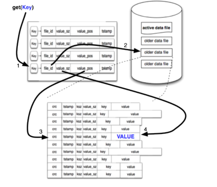

# 数据库开源项目RoseDB学习总结

首先感谢开源项目的作者Rose，他从0-1的完成了一个可用的数据库系统[RoseDB](https://github.com/flower-corp/rosedb)，用实践证明了即使像数据库这种复杂的系统也并不神秘，人人都可以去学习去实现去创造。

## 项目介绍
简单来说，rosedb 是一个稳定、快速、内嵌的 NoSQL key-value 数据库，支持多种数据结构，包含 `String`、`List`、`Hash`、`Set`、`Sorted Set`等，整体使用体验类似于我们常用的Redis。
当前项目是基本可用的状态，可以作为一个学习项目，因缺少生产环境充分验证，还不适合放到生产环境去规模化使用，尤其在分布式环境下还需更多的功能完善。
本着学习的态度，下面我从设计原理及代码实现等角度，结合自己对数据库的粗浅理解简单分析下该项目，希望能够帮助大家更好的理解数据库RoseDB设计理念和实现细节，如有不对之处，欢迎指正。

## 基本设计理念
RoseDB的设计模型主要参考[BitCask](https://riak.com/assets/bitcask-intro.pdf)，BitCask存储设计基于LSM（Log Structure Merge）的思想，但索引结构没有使用经典的LSM-tree，而是用的Hash Table，以期在某些场景获取更高的读写性能，
下面一张设计图可以很好的说明BitCask模型：



数据的C、U、D操作均以日志文件追加形式进行磁盘文件存储，同一时刻只有一个active文件可写，active文件写满阈值后归档并重新生成新的，积累的归档文件只读，并定期进行merge合并和压缩。
通过key获取数据value的过程可以简单描述为：
1. 通过key检索 哈希表获得hash 值，然后通过hash值获取最新数据所在的文件id及偏移(offset)
2. 通过文件id获取对应的文件，然后通过offset读取value

其中哈希索引value值是等长的，文件中每条数据记录（log entry）是不等长的，但有一个等长的header，header中包含了key的长度，value的长度，以及value的crc32校验码等（很像协议编码）。
数据记录的格式如下：
```go

// The encoded log Entry looks like:
// +-------+--------+----------+------------+-----------+-------+---------+
// |  crc  |  type  | key size | value size | expiresAt |  key  |  value  |
// +-------+--------+----------+------------+-----------+-------+---------+
// |------------------------HEADER----------------------|
//         |--------------------------crc check---------------------------|
```

## 代码实现
项目由go语言实现，标准的go mod工程，代码质量还不错，结构也比较清晰，很方便阅读和学习。
多数的数据库系统基本都分为两个模块，应用模块、存储引擎模块，我们也以这两个模块对rosedb做分析说明。

### 应用模块
完全兼容redis协议对外提供服务，包括完成命令入参解析及校验，然后调用存储引擎层的接口并返回结果。
redis协议服务主要基于第三方开源项目[redcon](github.com/tidwall/redcon), 我暂时没有去深究这个依赖项目，后续倒是可以对比redis来比较一下在网络线程模型上的差异和优劣。

### 存储引擎模块
数据库存储引擎基本有两大方向，日志结构存储引擎（LSM）和面向页的存储引擎（B+Tree），RoseDB基于LSM，但用HashTable做索引数据结构代替LSM-Tree。
#### 哈希索引
谈到哈希表，不得不想到它的一些局限性：
- 哈希表必须全部放入内存，所以大量的键的场景下哈希冲突严重性能会大幅减低。当然，原则上hashmap也可以在磁盘维护，但因为需要大量随机io，性能表现不好
- 另外哈希表的无序性，对于区间查询的效率不高
  RoseDB哈希表本身的实现依赖开源项目[go-adaptive-radix-tree](github.com/plar/go-adaptive-radix-tree), 该项目用go实现了[Adaptive Radix Tree](https://db.in.tum.de/~leis/papers/ART.pdf),
  ART是一种高效的数据结构，可以用来存储和检索大量的字符串，它的优势在于可以在O(1)的时间复杂度内完成插入、删除、查找等操作，而且在内存占用方面也比B+Tree更加高效。既具备内存hash table的高效，有支持范围查询的B+Tree的优势。
#### 关键点设计
1. 数据记录删除    
   数据文件中追加一条特殊的删除记录（墓碑），log merge时丢弃即可。
2. 崩溃恢复
- LSM本身就是基于追加日志的，天然支持WAL（write ahead logging），相比较而言基于B+Tree的mysql则需要单独构建 redo log 机制。
- 哈希表索引数据会因崩溃重启而丢失，这就需要重启时扫描所有日志文件进行重建索引，需要较多的时间。为了提高效率，常用做法是每个日志文件会伴随维护一份hashmap快照存储在磁盘上，从而更快的加载到内存重建索引。 但rosedb暂时仍保留了全量扫描的方法，暂未做此优化。
- rosedb的每条数据记录都有crc校验数据完整性，崩溃导致的部分写入引起的数据损坏记录会直接丢弃。
3. 并发控制
   hash索引有一个全局的读写锁，数据写入需要先获得写锁，所以保证单线程的追加日志，严格保证顺序，而日志因为是不可变的，所以可以同时被多线程读取，只需获取读锁。
   相比mysql 的mvcc要简单的多，这也是LSM在事务处理上的天然优势。以下为db实现的strings的索引结构，包含一个读写锁和一个art。
```go
type strIndex struct {
	mu      *sync.RWMutex
	idxTree *art.AdaptiveRadixTree
}
```
### 数据结构实现
RoseDB支持包含 `String`、`List`、`Hash`、`Set`、`Sorted Set`等多种数据结构，
各种数据结构在存储实现上都是独立的，独立的物理文件，独立的哈希表实例，互相不会影响。除了Sorted Set需要用较复杂的数据结构跳表实现，其他数据结构实现相对简单。

## 欢迎关注交流
如果你也厌烦了平时的CRUD，有兴趣想学习一下比如数据库这种偏基础的系统知识，更深入的学习一下数据库知识，可以看看这个项目，相信会有不少收获，为以后的面试求职更大的硬核保障。
我也是正是基于此想法，最近开始主动学习一些数据库方向上的知识，尤其关注一些开源实现，后续我会更多的分享一些数据库相关其他的一些开源项目，欢迎关注。


   